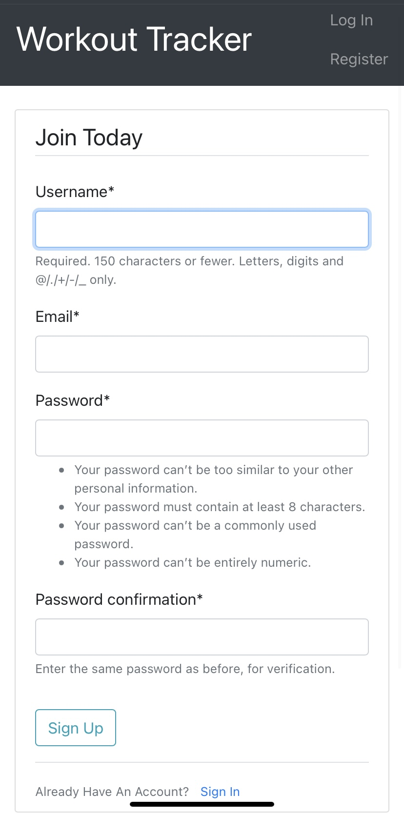
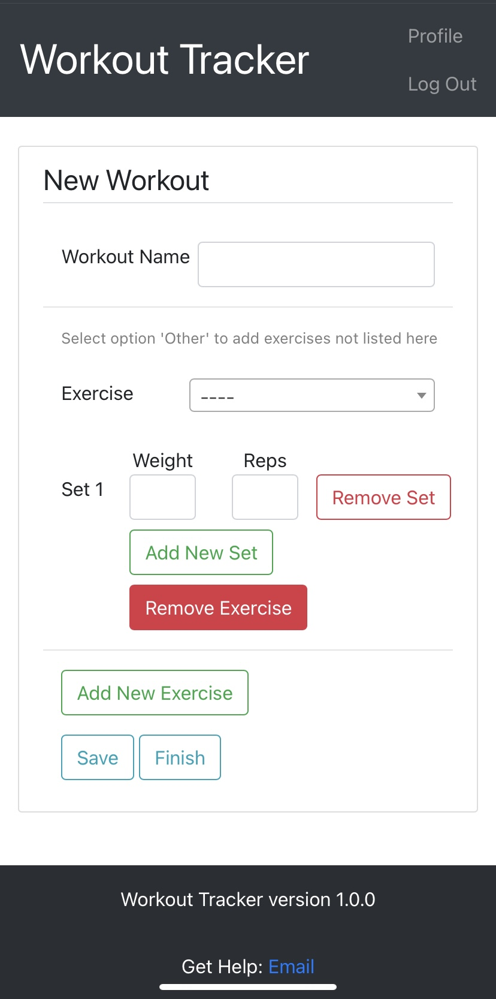
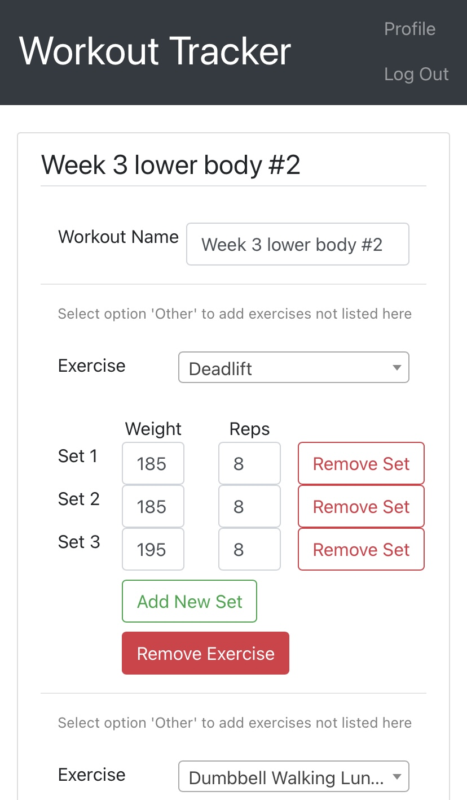
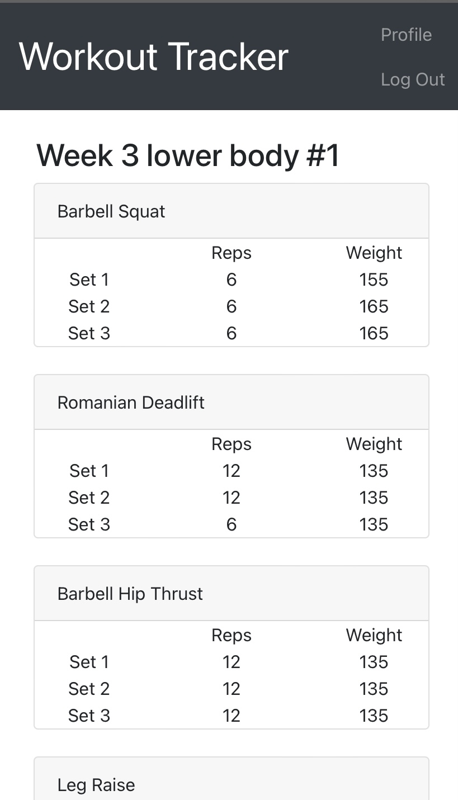

# Workout Tracker

A website for recording your workouts. This allows users to record their workout data flexibly. 

## Main features

- Workout creation from is fully dynamic.
- There is no limit on how many exercises a workout can have (each workout must have at least one exercise).
- An exercise can have as many sets as necessary (each exercise must at least have one set).
- each set may have any integer weight and number of reps
- Workouts can be edited after being created.

## Screenshots 

| Register Page:  | Login Page:  |
|:---:|:---:|
|   |  | 

| Workout Create Page:  | Workout Update Page:  |
|:---:|:---:|
|   |  | 

| Workout Overview Page:  | Workout Detail Page:  |
|:---:|:---:|
|   |  | 